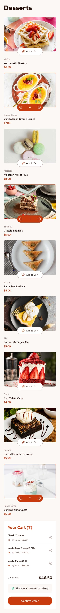

# 🛒 Product List with Cart

This is a solution to the [Product list with cart challenge on Frontend Mentor](https://www.frontendmentor.io/challenges/product-list-with-cart-5MmqLVAp_d). This challenge helped me practice building a responsive and interactive shopping cart interface using **React**, including managing state, handling modals, and dynamic UI updates.

---

## 📋 Table of Contents

- [Overview](#overview)  
  - [Screenshot](#screenshot)  
  - [Live Links](#live-links)  
  - [Built With](#built-with)
  - [Backend Features](#backend-features)
- [Author](#author)

---

## Overview

Users should be able to:

- Add items to the cart and remove them.  
- Increase or decrease the number of items in the cart.  
- See an order confirmation modal when they click "Confirm Order."  
- Reset their selections when they click "Start New Order."  
- View the optimal layout depending on their device’s screen size.  
- See hover and focus states for all interactive elements.

---

### Screenshot

---

### Live Links

- 📁 GitHub Repository: [Product List with Cart](https://github.com/vedantagrawal524/product-list-with-cart)  
- 🌐 Live Site: [https://product-list-with-cart524.vercel.app/](https://product-list-with-cart524.vercel.app/)

---

### Built With

- HTML5  
- CSS Flexbox & Grid  
- TailWind CSS
- Javascript
- React
- JSON data handling  
- Mobile-first workflow  
- [Vercel](https://vercel.com/) for deployment
- Node.js
- Express.js
- MongoDB
- Mongoose
- [Render](https://render.com/) for Server deployment  

---

### Backend Features

- Created an **Express.js server** to handle Order submissions.
- Order submitted are stored securely in a **MongoDB database**.
- Used **Mongoose** to define the Order schema and perform validations.
- Hosted backend using **Render**.

---

## Author

- Portfolio – _Vedant Agrawal_  
- Frontend Mentor – [@vedantagrawal524](https://www.frontendmentor.io/profile/vedantagrawal524)  
- GitHub – [@vedantagrawal524](https://github.com/vedantagrawal524)

---

📝 _Coded with focus, fun, and finesse. Feel free to explore, fork, or suggest improvements!_
